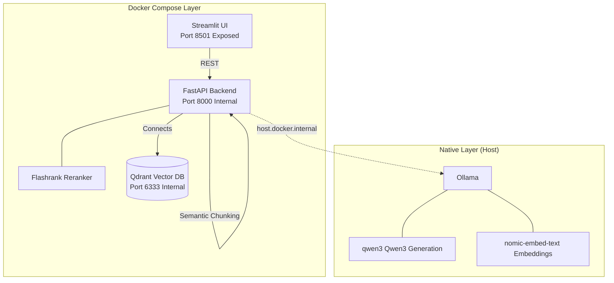

<div align="center">

<h1>📘 Chat with Your PDF</h1>
<h3>A Privacy-First, Self-Hosted RAG System with Semantic Edge</h3>

<p>
  
  
  
  
  
  
  
</p>

<p>
  <b>Upload a PDF. Ask document-grounded questions. Get local, private answers with semantic chunking, Qdrant vector store, and Qwen3.</b>
</p>

<br/>

</div>

---

## 🌟 Project Philosophy

This is a **privacy-first, self-hosted RAG system** distributed as an open source tool.

- 🔒 **Zero data leaves the user's machine**
- 💻 **Works on any reasonable developer hardware**
- ⚡ **One-command startup after initial setup**
- 🏭 **Every local component has a direct production equivalent**
- ☁️ **No cloud dependency for inference, ever**

---

## 🏗️ System Architecture



### Components Isolation
- **Streamlit (`localhost:8501`)**: The *only* visible interface.
- **FastAPI / Qdrant**: Securely locked inside the Docker network.
- **Ollama**: Exclusively runs natively on Mac/Windows for maximum GPU passthrough (M-Series Metal/CUDA).

---

## 🛠️ Technology Stack Breakdown

| Layer | Technology | Details |
|---|---|---|
| **Frontend UI** | Streamlit | Clean UI handling PDF uploads and chat. |
| **Backend API** | FastAPI + Uvicorn | Dedicated async API orchestration layer separating UI from mechanics. |
| **Orchestration** | LangChain | Framework tying retrieval + generation. |
| **Vector Database** | Qdrant | Concurrent-safe, dockerized, persistent volume, replacing FAISS. |
| **Embeddings** | `nomic-embed-text-v1.5` | Wide 8192 token context window. Rendered via native Ollama. |
| **Chunking** | Semantic Chunking | Breaks by conceptual boundaries instead of naive physical characters. |
| **Sparse Retrieval** | BM25 | Pure keyword lookups for specific nouns and names. |
| **Reranker** | Flashrank | Fast ONNX CPU reranking to filter top 20 fused candidates to the top 5. |
| **Generation Model** | Qwen3 8B | Via Ollama (Thinking Mode disabled to ensure pure grounded RAG generation). |

---

## 🚀 Advanced Retrieval Pipeline

```text
PDF Upload -> Text Extraction
       ↓
Semantic Chunking (respecting meaning, not max length)
       ↓
Chunk Quality Gate
       ↓
nomic-embed-text → Qdrant (Dense Index)   +   BM25 (Sparse Index)
       ↓
Reciprocal Rank Fusion (RRF) -> Top 20
       ↓
Flashrank Reranker -> Top 5
       ↓
Neighbor Context Expansion
       ↓
Qwen3 8B (via Ollama) -> Final Grounded Answer
```

---

## 💻 Hardware Tiers & Supported Modes

The system requires simple `.env` flag configurations to match your machine power: `MODEL_TIER=performance` or `MODEL_TIER=lite`.

| Hardware | Mode | Generation Model | Embedding Model |
|---|---|---|---|
| Mac M1/M2/M3/M4 (16GB+) | `performance` | Qwen3 8B | `nomic-embed-text` |
| Mac M1/M2/M3/M4 (8GB) | `lite` | Qwen3 1.7B | `nomic-embed-text` |
| Windows/Linux (GPU 8GB+) | `performance` | Qwen3 8B | `nomic-embed-text` |
| Windows/Linux (CPU 16GB) | `lite` | Qwen3 1.7B | `nomic-embed-text` |
| Below 8GB RAM | *Not Supported* | — | — |

---

## ⚙️ Setup & Deployment Flow

Get your private RAG interface running in **under 15 minutes**:

### Step 1: Install Ollama (Native)
Download and install [Ollama](https://ollama.com/) naturally for your OS (Do not containerize).
```bash
ollama pull qwen3:8b
ollama pull nomic-embed-text
```

*(Optional: Set `OLLAMA_NUM_PARALLEL=2` to allow concurrent embedding + generation)*

### Step 2: Install Docker
Make sure [Docker Desktop](https://www.docker.com/) is installed and running.

### Step 3: Clone & Configure
```bash
git clone https://github.com/VaibhavGIT5048/Semantic-Question-Answering-over-Large-Documents-using-RAG-LLaMA-3-Ollama.git
cd Semantic-Question-Answering-over-Large-Documents-using-RAG-LLaMA-3-Ollama

# Copy environment config
cp .env.example .env
```
Ensure your `.env` contains `MODEL_TIER=performance` (or lite).

### Step 4: Launch via Docker Compose
```bash
docker compose up
```

Open your browser to `http://localhost:8501` to start chatting!

*(⚠️ Note to Linux users: Docker handles Mac/Win `host.docker.internal` cleanly. Under Linux, we enforce `host-gateway` bridge in Docker compose so behaviors remain equivalent.)*

---

## 📊 Evaluation & Diagnostics

The evaluation stack leverages the **RAGAS** framework, powered by **Qwen3 1.7B** for fast judge processing. 

### Metrics Validated:
- **Retrieval Metrics**: Recall@K, MRR, NDCG, Hit Rate
- **Generation Metrics**: Faithfulness, Context Precision, Answer Relevance
- **Diagnostics**: Independent robust OOD Evaluation endpoints.

*Because retrieval metrics run entirely independent of generation, evaluation is remarkably fast without exhausting GPU bottlenecks.*

---

## 🔄 Updating to Latest Future Releases

```bash
git pull
docker compose up --build
```
Two commands rebuild only changed layers — perfectly caching unaltered components. If fundamental embedding dimensions or chunking strategies shift across major updates, internal migration loops trigger safely on startup.

---

## 📄 License & Privacy

This project is licensed under the **MIT License**.
*Zero telemetry natively. Your data never touches a public cloud.*

---

## 🙋‍♂️ Author

<div align="center">

**Vaibhav**  
B.Tech Computer Science (Data Science & ML) | MRIIRS, Delhi  
President @ Data Dynamos | Hackathon Builder | ML Researcher

[](https://github.com/VaibhavGIT5048)

</div>

---

<div align="center">
  <sub>Built with Streamlit, FastAPI, Docker, Qdrant, Ollama & Qwen3.</sub>
</div>
