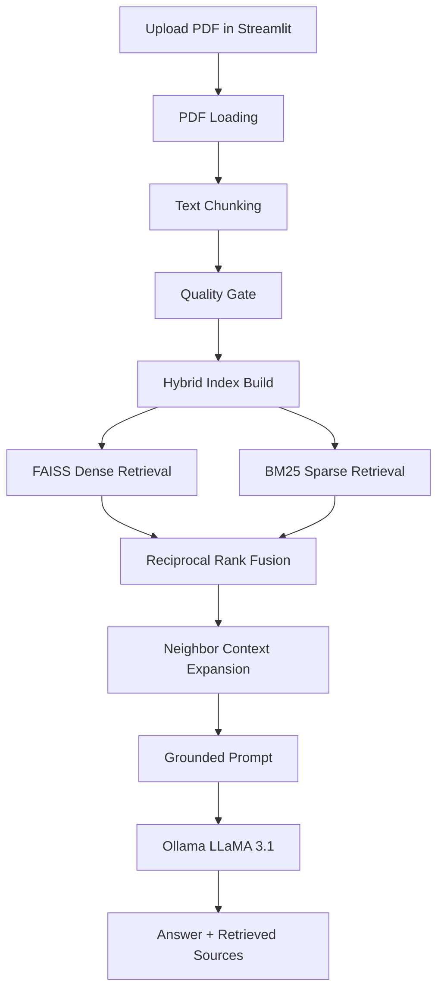

<div align="center">

<h1>📘 Chat with Your PDF</h1>
<h3>Semantic Question Answering over Large Documents using RAG + LLaMA 3.1 (Ollama)</h3>

<p>
  
  
  
  
  
  
</p>

<p>
  <b>Upload a PDF. Ask document-grounded questions. Get local, private answers with hybrid retrieval and Ollama.</b>
</p>

<br/>

</div>

---

## 🌟 Why This Project?

Large PDFs such as reports, papers, contracts, manuals, and policy documents are hard to search manually. Keyword search misses meaning, and cloud chat tools can require sending private documents outside your machine.

This project solves that with a local Retrieval-Augmented Generation pipeline:

- ✅ **Runs locally** with Ollama and open-source embeddings
- ✅ **Uses hybrid retrieval** with FAISS semantic search + BM25 keyword search
- ✅ **Handles large PDFs** through page loading, chunking, overlap, and metadata
- ✅ **Improves retrieval quality** with a configurable chunk quality gate
- ✅ **Provides a Streamlit chat UI** for upload, processing, retrieval, and answers
- ✅ **Includes evaluation tooling** for in-scope and out-of-scope QA checks

---

## 🧠 How It Works — Architecture Overview



> **RAG (Retrieval-Augmented Generation)** retrieves the most relevant document chunks first, then asks the language model to answer using only that retrieved context.

---

## ✨ Features

| Feature | Description |
|---|---|
| 📄 **PDF Upload** | Upload PDFs through the Streamlit browser UI |
| 🧾 **PDF Extraction** | Uses `pdfplumber` with a `pypdf` fallback |
| 🧩 **Smart Chunking** | Recursive chunking with configurable size and overlap |
| 🚦 **Quality Gate** | Scores chunks using token length, punctuation, entity density, URL filtering, and overlap similarity |
| 🔍 **Hybrid Retrieval** | Combines FAISS dense retrieval and BM25 keyword retrieval |
| 🔁 **Rank Fusion** | Uses reciprocal rank fusion to merge semantic and keyword results |
| 📚 **Source Context** | Shows retrieved chunks, scores, pages, and chunk IDs |
| 🤖 **Local LLM** | Uses Ollama via `langchain-ollama` |
| 📊 **Evaluation Harness** | Generates QA datasets, adds OOD questions, and writes evaluation reports |
| 🔒 **Private by Default** | Documents and indexes stay on your local machine |

---

## 🛠️ Tech Stack

| Layer | Technology |
|---|---|
| **UI** | Streamlit |
| **LLM** | LLaMA 3.1 via Ollama |
| **RAG Framework** | LangChain |
| **Dense Retrieval** | FAISS |
| **Sparse Retrieval** | BM25 via `rank-bm25` |
| **Embeddings** | `sentence-transformers/all-MiniLM-L6-v2` |
| **Quality Scoring** | `tiktoken`, `sentence-transformers`, optional spaCy |
| **PDF Parsing** | `pdfplumber`, `pypdf` |
| **Evaluation** | Ollama OpenAI-compatible endpoint, pandas, RAGAS-style judge prompts |

---

## ⚙️ Installation & Setup

### Prerequisites

Before starting, make sure you have:

- Python 3.10 or higher
- [uv](https://docs.astral.sh/uv/) installed
- [Ollama](https://ollama.com/) installed and running
- Enough disk space for the local Ollama model and embedding model cache

---

### Step 1 — Clone the Repository

```bash
git clone https://github.com/VaibhavGIT5048/Semantic-Question-Answering-over-Large-Documents-using-RAG-LLaMA-3-Ollama.git
cd Semantic-Question-Answering-over-Large-Documents-using-RAG-LLaMA-3-Ollama
```

---

### Step 2 — Install Ollama Model

```bash
ollama pull llama3.1:8b
```

Make sure Ollama is running before you start the app:

```bash
ollama serve
```

---

### Step 3 — Install Python Dependencies

```bash
uv pip install streamlit langchain langchain-community langchain-core langchain-huggingface langchain-ollama faiss-cpu sentence-transformers rank-bm25 pypdf pdfplumber spacy tiktoken scikit-learn pandas numpy python-dotenv openai ragas
uv run python -m spacy download en_core_web_sm
```

If you do not install the spaCy model, the quality gate still runs with a lightweight fallback entity heuristic.

---

### Step 4 — Launch the App

```bash
uv run streamlit run rag_ui.py
```

Your browser will open at the Streamlit local URL, usually `http://localhost:8501`.

---

## 🚀 Usage

1. Upload a PDF from the Streamlit UI.
2. Adjust chunk size, chunk overlap, quality threshold, retrieval count, or model name from the sidebar.
3. Click **Process PDF and Build RAG Index**.
4. Ask a natural language question about the uploaded PDF.
5. Review the answer and retrieved source chunks.

### Example Questions

```text
"Summarize the executive summary."
"What are the main recommendations?"
"Which trends are discussed in the document?"
"What does the report say about risk or uncertainty?"
"Compare the key growth areas mentioned across the report."
```

---

## 📁 Project Structure

```text
.
├── rag_ui.py                # Streamlit entry point
├── APP/
│   ├── app.py               # Main Streamlit RAG app
│   ├── pdf_loading.py       # PDF extraction with metadata
│   ├── chunking.py          # Recursive chunking and JSONL export
│   ├── quality_gate.py      # Chunk scoring and pass/fail tagging
│   ├── vector_store.py      # FAISS + BM25 indexing and hybrid retrieval
│   ├── embedding.py         # Standalone embedding test script
│   ├── generator.py         # Standalone terminal RAG chat script
│   └── ragas_evaluation.py  # Evaluation dataset generation and reporting
├── chunks/                  # Generated chunk JSONL files, ignored by git
├── data/                    # Uploaded/source PDFs, ignored by git
├── indexes/                 # Generated FAISS/BM25 indexes, ignored by git
├── evals/                   # Generated evaluation datasets/reports, ignored by git
└── evaluation/              # Additional generated evaluation outputs, ignored by git
```

---

## 🔧 Configuration

The main UI exposes the most useful settings in the sidebar:

| Setting | Default | Purpose |
|---|---:|---|
| **Ollama model** | `llama3.1:8b` | Local model used for answer generation |
| **Chunk size** | `1000` | Maximum characters per chunk |
| **Chunk overlap** | `150` | Repeated characters between adjacent chunks |
| **Quality threshold** | `4.0` | Minimum quality score used for pass/fail tagging |
| **Retrieved chunks** | `4` | Number of top fused retrieval results shown |

Default embedding model:

```text
sentence-transformers/all-MiniLM-L6-v2
```

Evaluation environment variables:

```bash
OLLAMA_BASE_URL=http://localhost:11434/v1
OLLAMA_API_KEY=ollama
OLLAMA_STUDENT_MODEL=llama3.1:8b
OLLAMA_JUDGE_MODEL=llama3.1:8b
OLLAMA_GENERATOR_MODEL=llama3.1:8b
```

---

## 📊 Evaluation Workflow

After processing a document and building indexes, run:

```bash
uv run python APP/ragas_evaluation.py --regenerate --num-questions 20
```

The evaluator can:

- Generate in-scope QA pairs from chunks
- Generate out-of-scope questions
- Retrieve context with the same hybrid retriever
- Ask the student model for an answer
- Judge the answer with an Ollama OpenAI-compatible client
- Write detailed metrics to `evals/experiments/fast_eval_report.csv`

Tracked source code stays clean because generated chunks, indexes, PDFs, and evaluation reports are ignored by git.

---

## 🧪 Typical Generated Outputs

| Path | Purpose |
|---|---|
| `chunks/chunks.jsonl` | Raw chunk output |
| `chunks/chunks_processed.jsonl` | Quality-scored chunks |
| `indexes/faiss_index/` | Dense vector index |
| `indexes/bm25_data.pkl` | Sparse BM25 index |
| `evals/datasets/auto_eval.jsonl` | Generated evaluation dataset |
| `evals/experiments/fast_eval_report.csv` | Evaluation results |

---

## 🐛 Troubleshooting

**Ollama connection error**

```bash
ollama serve
ollama pull llama3.1:8b
```

**Streamlit cannot find dependencies**

```bash
uv run streamlit run rag_ui.py
```

**spaCy model missing**

```bash
uv run python -m spacy download en_core_web_sm
```

**No retrieval results**

Lower the quality threshold in the sidebar and process the PDF again. Also check whether the PDF text extraction produced readable text.

**Evaluation fails to connect to judge model**

Confirm the OpenAI-compatible Ollama endpoint is available at `http://localhost:11434/v1` and that the configured model exists locally.

---

## 🗺️ Roadmap

- [x] Streamlit PDF upload and chat
- [x] Modular PDF loading, chunking, quality gate, and retrieval layers
- [x] Hybrid FAISS + BM25 retrieval
- [x] Ollama-based local answer generation
- [x] Evaluation harness with in-scope and OOD questions
- [ ] Persist and reload processed document sessions from the UI
- [ ] Multi-PDF comparison
- [ ] Inline source highlighting
- [ ] Docker setup for reproducible local runs

---

## 🤝 Contributing

Contributions are welcome. Keep changes focused and avoid committing local artifacts such as PDFs, chunks, indexes, virtual environments, and evaluation outputs.

```bash
git checkout -b feature/your-feature-name
git commit -m "feat: add your feature"
git push origin feature/your-feature-name
```

---

## 📄 License

This project is licensed under the **MIT License**.

---

## 🙋‍♂️ Author

<div align="center">

**Vaibhav**  
B.Tech Computer Science (Data Science & ML) | MRIIRS, Delhi  
President @ Data Dynamos | Hackathon Builder | ML Researcher

[](https://github.com/VaibhavGIT5048)

</div>

---

## ⭐ Show Some Love

If this project helped you, consider giving it a ⭐ on GitHub.

---

<div align="center">
  <sub>Built with RAG, Ollama, LangChain, FAISS, BM25, and Streamlit.</sub>
</div>
