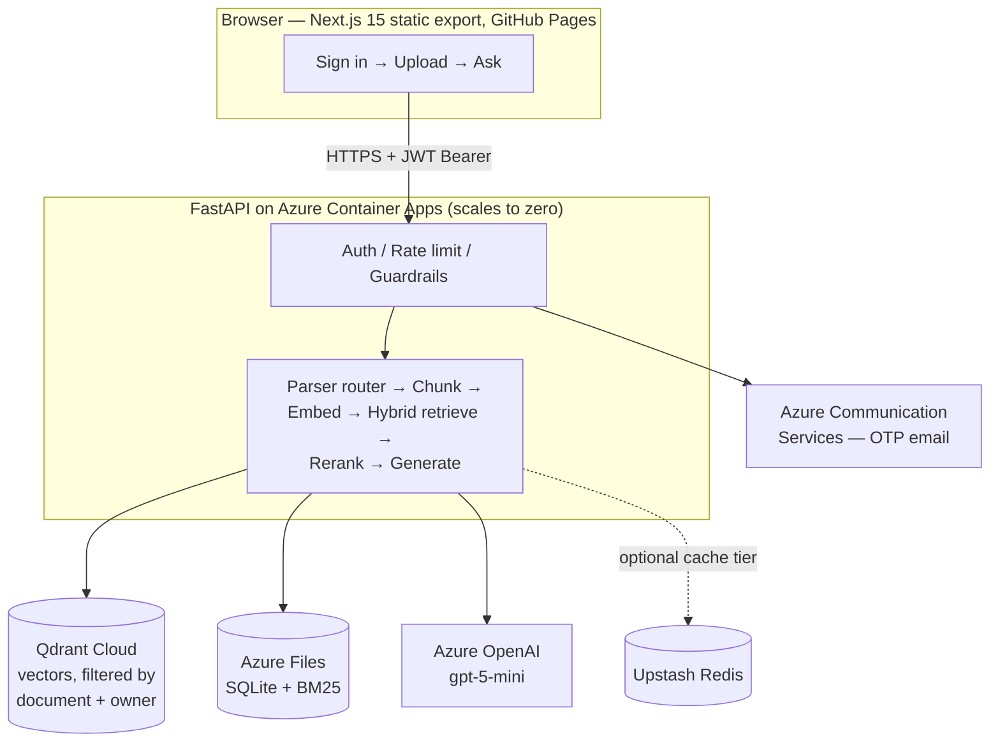

<div align="center">

<h1>📘 Grounded RAG</h1>
<h3>A production, multi-tenant Retrieval-Augmented Generation platform</h3>

<p>
  
  
  
  
  
  
</p>

<p>
  <b>Sign in, upload a document, and ask it questions in plain language.</b><br/>
  Every answer is grounded strictly in that document's own text, with a clickable citation back to the exact source page.
</p>

<p>
  🔗 <a href="https://vaibhavgit5048.github.io/private-rag-core/">Live app</a> ·
  🧪 <a href="https://vaibhavgit5048.github.io/private-rag-core/dev/">Dev preview</a> ·
  📄 <a href="https://vaibhavgit5048.github.io/private-rag-core/privacy/">Privacy Policy</a>
</p>

<br/>

</div>

---

## 🌟 What this is

Grounded RAG is a hosted, multi-tenant document Q&A platform, not a local script. A signed-in user uploads a PDF, Word file, spreadsheet, or scanned image, and can then ask natural-language questions about it. The model is only ever shown text retrieved from that user's own document — it is instructed to refuse when the document doesn't support an answer, and every claim in a response is traceable to its source.

- 🔒 **Real accounts, mandatory login** — GitHub OAuth, Google OAuth, or email + OTP. No anonymous ingest or query path.
- 🧠 **Self-hosted embeddings by default** — bge-m3 runs in-process in the backend container, so the highest-volume pipeline stage (reading every word of every document) is structurally free and never leaves the infrastructure.
- ☁️ **Azure-billed generation** (`gpt-5-mini`), with an optional bring-your-own-OpenAI-key path for anyone who wants generation billed to their own account instead.
- 🏢 **Tenant isolation enforced at four independent layers** — vector search, filesystem, database, and cache all scope by owner, so no single mistake can leak one user's document to another.
- 📜 **A real Privacy Policy with recorded, versioned consent** — not a footer link nobody reads.

For the full build log — every architecture decision, every bug and its root cause, every rejected alternative and why — see [`PROJECT_DOCUMENTATION.txt`](PROJECT_DOCUMENTATION.txt).

---

## 🏗️ System Architecture


```mermaid
flowchart TD
    subgraph Browser["Browser — Next.js 15 static export, GitHub Pages"]
        UI[Sign in → Upload → Ask]
    end

    UI -->|HTTPS + JWT Bearer| API

    subgraph Backend["FastAPI on Azure Container Apps (scales to zero)"]
        API[Auth / Rate limit / Guardrails] --> PIPE[Parser router → Chunk →
Embed → Hybrid retrieve →
Rerank → Generate]
    end

    PIPE --> QDRANT[(Qdrant Cloud
vectors, filtered by
document + owner)]
    PIPE --> FILES[(Azure Files
SQLite + BM25)]
    PIPE --> AOAI[Azure OpenAI
gpt-5-mini]
    API --> ACS[Azure Communication
Services — OTP email]
    PIPE -.optional cache tier.-> REDIS[(Upstash Redis)]
```

Embeddings run **in-process** inside the FastAPI container — there is no external embedding API call, and no per-token embedding cost.

---

## 🛠️ Technology stack

| Layer | Technology | Notes |
|---|---|---|
| **Frontend** | Next.js 15 (static export) + TypeScript | Deployed to GitHub Pages — no Node server in production. |
| **Backend** | FastAPI + Uvicorn, Python 3.11 | Deployed as a container on Azure Container Apps, scale-to-zero. |
| **Auth** | JWT + OAuth 2.0 (GitHub, Google) + email/OTP | Bcrypt password hashing, single-use hashed OTP codes, account lockout after repeated failures. |
| **Vector store** | Qdrant Cloud | One shared collection per environment, isolated by a `document_id` + `owner_id` payload filter. |
| **Embeddings** | Self-hosted `BAAI/bge-m3` | Runs in-process; falls back to OpenAI embeddings if configured. |
| **Sparse retrieval** | BM25 (per document) | Fused with dense search via Reciprocal Rank Fusion. |
| **Reranker** | FlashRank | Cross-encoder rerank over the fused candidate pool. |
| **Generation** | Azure OpenAI `gpt-5-mini` | Optional bring-your-own OpenAI key, browser-local, never persisted server-side. |
| **Document parsing** | Local extraction → Azure Document Intelligence → Mistral OCR | Tiered escalation: cheapest option first, paid vendor only if the free tier's output fails a quality check. |
| **Metadata / history** | SQLite | Users, OTP, documents, chat history — on an Azure Files volume. |
| **Cache** | Upstash Redis (optional tier) | Caches parsed document artifacts, not answers. |
| **Evaluation** | RAGAS | Faithfulness, Answer Relevancy, Context Precision, Context Recall. |

---

## 🚀 Pipeline, stage by stage

```text
INGEST                                             QUERY
  Upload                                             Question
    ↓                                                  ↓
  Parser router (local → Doc Intelligence → OCR)     Sanitize + injection screen
    ↓                                                  ↓
  Structure-aware chunking                           Query rewrite (if follow-up)
    ↓                                                  ↓
  Quality gate (scores, never drops)                 Hybrid retrieve (dense + BM25)
    ↓                                                  ↓
  Embed (bge-m3, batched)                            Reciprocal Rank Fusion
    ↓                                                  ↓
  Index → Qdrant + per-doc BM25 pickle               FlashRank rerank → neighbor expand
                                                        ↓
                                                      Token-budget assembly
                                                        ↓
                                                      Azure OpenAI generation
                                                        ↓
                                                      Output validation → cited answer
```

---

## 📁 Project structure

```text
APP/                     FastAPI service: auth, RAG pipeline, providers, parsers, security
  rag/                   Chunking, embedding, retrieval, quality gate, vector store, cache
  auth/                  OAuth exchange, password hashing, OTP, JWT, email
  security/              Prompt-injection guardrails
frontend/                Next.js 15 app (App Router), static-exported
prompts/                 System prompt + untrusted-data wrapper (kept outside APP/ deliberately)
eval/                    RAGAS evaluation harness
scripts/                 One-off / diagnostic scripts
tests/                   Unit and integration tests
docker/                  Dockerfiles (api, frontend) + model-fetch script
.github/workflows/       CI, backend deploy, frontend deploy
```

---

## 💻 Running it locally

The hosted app needs no setup — see the live links above. To run the full stack locally instead:

**Requirements:** [Docker Desktop](https://www.docker.com/) (or Docker Engine + Compose).

```bash
git clone https://github.com/VaibhavGIT5048/private-rag-core.git
cd private-rag-core

cp .env.example .env
```

Edit `.env` and set at minimum `JWT_SECRET_KEY` (generate one with `python -c "import secrets; print(secrets.token_urlsafe(48))"`) plus whichever generation/parsing/auth providers you want active — see the comments in `.env.example` for the full list (Azure OpenAI or plain OpenAI, GitHub/Google OAuth, Azure Document Intelligence, Mistral OCR, Azure Communication Services). Nothing beyond `JWT_SECRET_KEY` is strictly required to start the app; unconfigured providers are simply skipped rather than treated as errors.

```bash
docker compose up
```

Open `http://localhost:3000`. `.env.docker` (already committed, no secrets in it) supplies the container-network-specific overrides — you don't need to edit it.

---

## 🔐 Security & privacy, briefly

- Login is mandatory everywhere except `/health`, `/warmup`, and the auth routes themselves.
- Every request is rate-limited per authenticated user; login additionally locks out after repeated failed attempts.
- Retrieved document text is wrapped in an explicit untrusted-data boundary before it ever reaches the model — a three-layer defense (input sanitization, structural boundary, output validation) against both direct and indirect prompt injection.
- Deleting a document purges its vectors and index, not just its database row.
- A mandatory, versioned consent flow records acceptance of the [Privacy Policy](https://vaibhavgit5048.github.io/private-rag-core/privacy/) for every account.

The full reasoning, threat model, and what's still only planned (PII redaction, Postgres row-level security) is in `PROJECT_DOCUMENTATION.txt`, section 7.

---

## 📊 Evaluation

`eval/ragas_evaluation.py` runs the real retrieval pipeline over a question set and scores it with [RAGAS](https://github.com/explodinggradients/ragas): **Faithfulness**, **Answer Relevancy**, **Context Precision**, and **Context Recall** — the first pair grading generation quality, the second pair grading retrieval quality independently, so a regression can be traced to the right stage instead of a single blended "looks good" score.

---

## 📄 License

MIT.

---

## 🙋‍♂️ Author

<div align="center">

**Vaibhav**
B.Tech Computer Science (Data Science & ML) | MRIIRS, Delhi
President @ Data Dynamos | Hackathon Builder | ML Researcher

[](https://github.com/VaibhavGIT5048)

</div>

---

<div align="center">
       <sub>Built with Next.js, FastAPI, Azure, Qdrant & Claude Code.</sub>
</div>
